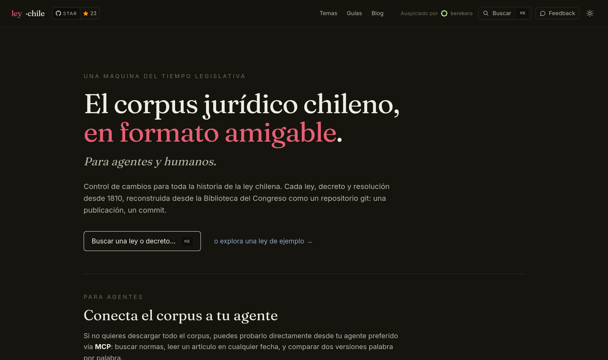
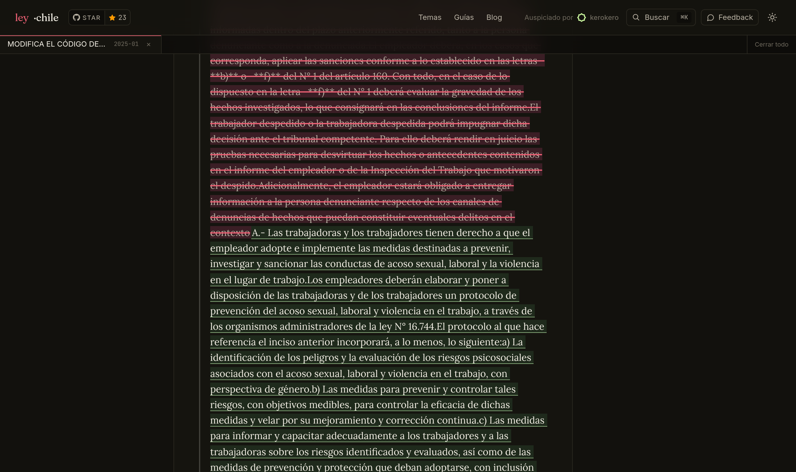

<h1 align="center">ley&nbsp;·&nbsp;chile</h1>
<p align="center"><b>El corpus jurídico chileno, en formato amigable. Para agentes y humanos.</b></p>

<p align="center">
  Control de cambios para toda la historia de la ley chilena. Cada ley, decreto y
  resolución <b>desde 1810</b>, reconstruida desde la
  <a href="https://www.bcn.cl/leychile"><b>Biblioteca del Congreso Nacional</b></a>
  como un repositorio git: <b>una publicación, un commit</b>.
</p>

<p align="center">
  <a href="https://leyes.pisanvs.cl"></a>
  <a href="https://leyes.pisanvs.cl/api/mcp"></a>
  
  
  <a href="https://github.com/pisanvs/ley-chile/actions/workflows/pipeline.yml"></a>
  
</p>

<p align="center">
  <a href="https://leyes.pisanvs.cl"></a>
</p>

<p align="center">
  <a href="https://leyes.pisanvs.cl"><b>→ Explorar el sitio</b></a> ·
  <a href="https://leyes.pisanvs.cl/api/mcp"><b>Conectar por MCP</b></a> ·
  <a href="https://github.com/pisanvs/ley-chile/tree/historial"><b>El branch con los datos</b></a>
</p>

---

<!-- PIPELINE_STATUS_START -->
## Pipeline Status
| | |
|---|---|
| **Historial** | `███████████████████░` 95% · watermark 2026-06-06 · 339,065 / 353,511 buildable · 4,717 excluded (undated/sentinel) |
| **Cache**     | `████████████████████` 100% · 357,264 / 353,511 buildable fetched |
| **Last run**  | 2026-08-12 06:02 UTC |
<!-- PIPELINE_STATUS_END -->

<!-- GRAPH_STATUS_START -->
## Graph Build Status
| | |
|---|---|
| **Fetch normas** | `███████████████████░` 99% · 357,266 / 358,228 normas · complete ✅ |
| **Last run**     | 2026-08-12 06:02 UTC |
<!-- GRAPH_STATUS_END -->

> **Sobre estas barras.** *Graph Build Status* sigue la construcción del grafo de metadatos (`graph.json`): la descarga de la metadata de las ~358 mil normas del catálogo BCN. *Pipeline Status* sigue lo que viene después: cuántas normas tienen ya su historial de versiones reconstruido en la branch `historial`. Los denominadores cuentan sólo normas *construibles* (con fecha de publicación y al menos una vigencia real); las normas sin fecha o con fechas centinela quedan excluidas.

## Por qué existe

El sistema [LeyChile](https://www.bcn.cl/leychile) de la BCN publica **textos refundidos** — versiones consolidadas que ya incorporan todas las modificaciones — pero **sin historial de cambios**. Un texto vigente es una foto: no tiene autor, ni fecha de origen por artículo, ni forma de responder *«¿qué decía esto en 2013?»* o *«¿qué cambió, y quién lo cambió?»*.

Este proyecto reconstruye ese historial. Reescribe la ley chilena como un **repositorio git**: cada publicación legislativa es un commit, y cada artículo tiene su ventana de vigencia. Eso convierte una investigación en una consulta.

<p align="center">
  
</p>
<p align="center"><i>La vista <b>redline</b>: dos versiones de una ley comparadas palabra por palabra — lo eliminado en rojo, lo añadido en verde.</i></p>

## Para agentes — servidor MCP

Un servidor **[MCP](https://modelcontextprotocol.io)** remoto sobre todo el corpus, sólo lectura y sin autenticación:

```
https://leyes.pisanvs.cl/api/mcp
```

| Herramienta | Qué hace |
|---|---|
| `search_laws` | Busca normas por texto libre (con organismo + idNorma para desambiguar) |
| `get_law` | Metadatos + índice de artículos + historial de versiones de una norma |
| `get_article` | El texto de un artículo en cualquier fecha |
| `search_articles` | Ubica el artículo relevante dentro de una norma larga |
| `diff_versions` | Compara dos versiones de una norma |
| `get_modifications` | Qué normas modificaron a ésta, y a cuáles modifica |
| `list_versions` | Todas las versiones fechadas de una norma |

Añádelo con un clic desde la portada (Claude, Claude Code, Cursor, VS Code, Codex), o revisa [`/llms.txt`](https://leyes.pisanvs.cl/llms.txt) para las instrucciones legibles por agentes.

## Cómo funciona — el pipeline

Cuatro fases idempotentes y resumibles. `git` (la branch `historial`) es la **única fuente de verdad**; Postgres y Meilisearch son modelos de lectura derivados y descartables.

```
build_catalog.py   → catalog.json           (BCN SPARQL — todos los idNorma)
fetch_normas.py    → graph.json              (metadata LeyChile + expansión BFS)
fetch_versions.py  → cache/diffs, versions   (versiones + diffs por norma)
build_history.py   → git fast-import → branch historial
```

Cada commit en `historial` representa **un evento de publicación**: el texto de la norma nueva, más el texto actualizado de cada norma que ésta modificó, más derogaciones y symlinks de sucesión. La [GitHub Action `pipeline.yml`](.github/workflows/pipeline.yml) corre las cuatro fases cada 3 horas.

### Diseño de tres branches

| Branch | Contiene | Montada en |
|---|---|---|
| `main` | Scripts, config, CI. **Nunca** datos de leyes. | — |
| `pipeline-cache` (huérfana) | Versiones y diffs descargados | `./cache/` |
| `historial` (huérfana) | Los commits de leyes reconstruidos | `./historial/` |

## Correr el pipeline

```bash
pip install -r requirements.txt

# Pipeline completo (idempotente, resumible)
LEYCHILE_DATA_ROOT=./historial python scripts/run_pipeline.py

# Vista previa de commits, sin importar nada
LEYCHILE_DATA_ROOT=./historial python scripts/build_history.py --dry-run

# Tests (funciones puras — sin red ni git)
python -m pytest
```

Ver [`CLAUDE.md`](CLAUDE.md) para la arquitectura completa: detección de `DATA_ROOT`, el modelo cause-centered de commits, la expansión BFS, los enrichers de tramitación, y el port SSR del frontend.

## Fuentes de datos

| Fuente | Endpoint | Límite |
|---|---|---|
| BCN SPARQL | `https://datos.bcn.cl/sparql` | — |
| LeyChile norma JSON | `.../get_norma_json?idNorma=...` | adaptativo |
| LeyChile XML versionado | `.../obtxml?opt=7&idNorma={id}&idVersion={fecha}` | 1 req/s |

> **Fecha centinela.** LeyChile usa `2222-02-02` para versiones abiertas («vigente»). El filtro `int(fecha[:4]) <= 2100` la descarta.

## Proyectos similares

- [Free Law Project](https://free.law/) — jurisprudencia federal de EE. UU.
- [DC Council law-html](https://github.com/DCCouncil/law-html) — Código del Distrito de Columbia en git
- [nickvido/us-code](https://github.com/nickvido/us-code)

## Licencia

Los textos legales son documentos públicos del Estado de Chile. El código se distribuye bajo licencia **MIT**.

<p align="center"><sub>Auspiciado por <a href="https://www.kerokero.cl"><b>kerokero</b></a></sub></p>
